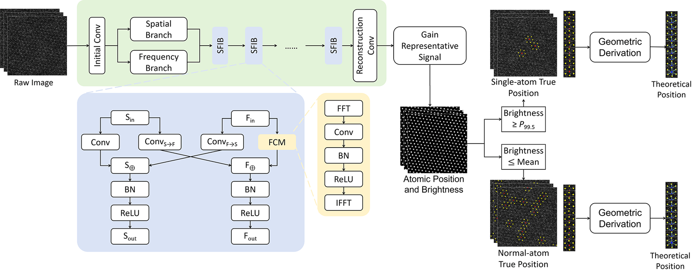
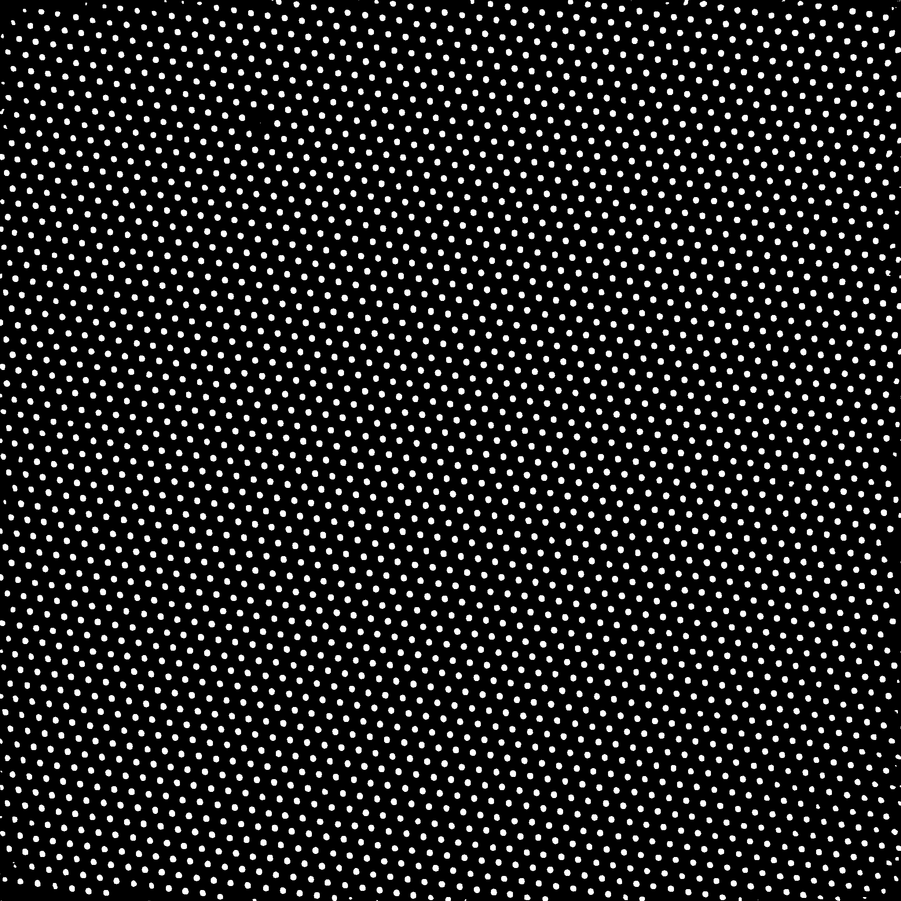
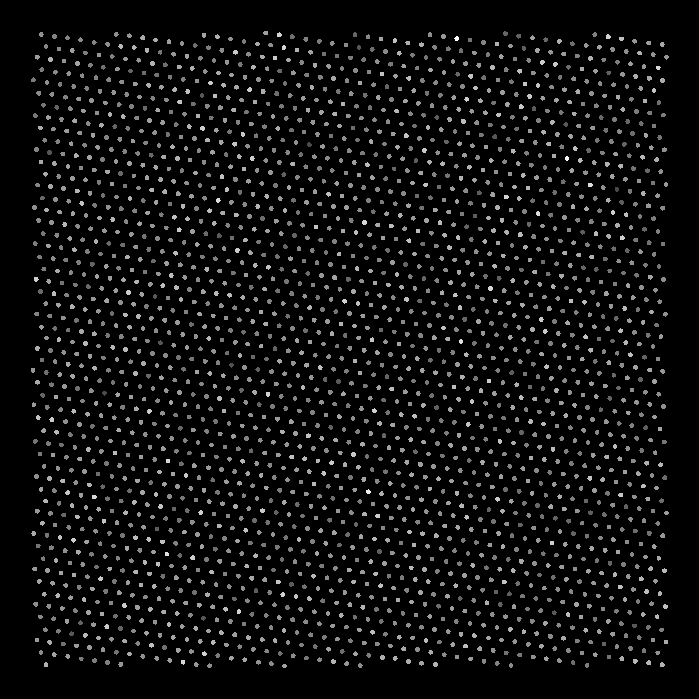

<p align="center">
  
# Machine Learning-Enabled Fast-Scan STEM for Precise Identification of Labile Single-Atom Sites
### 🚀 Nano Letters Under Review &nbsp;&nbsp; ** Ruining Jiang‡, Haiyang Zhang‡, Ruirui Liu, Lu Yu, Chao Li*, Jiuhui Han*, Yi Ding **

</p>

<br><br>

## 📖 Overview
<p align="center">

</p>
Fast-scan STEM enables capturing atomic dynamics but suffers from extreme noise, making single-atom identification unreliable.

We present a machine-learning-enhanced framework for robust atomic structure recovery under ultra-low SNR. Our approach builds upon prior spatial–frequency modeling methods, particularly the Spatial-Frequency Interactive Network ([SFIN](https://github.com/HeasonLee/SFIN)), to enable accurate localization of Pt atoms on MoS₂ under noisy imaging conditions.

This unlocks quantitative, physics-level analysis of dynamic single-atom behavior beyond conventional imaging limits.

## 🌟 Key Findings

### 1. Precise Localization of Labile Sites:
We quantified a random positional displacement of approximately 3.2% relative to ideal lattice sites, providing an empirical "snapshot" of the intrinsic structural disorder that is often overlooked in static models.

### 2. Direct Visualization of Electronic Heterogeneity:
Through Differential Phase Contrast (DPC) imaging, we directly visualized the inhomogeneous electrostatic landscapes surrounding individual Pt atoms. Our analysis suggests that this observed electronic heterogeneity may stems from the intrinsic, non-ideal positional distribution of these single atoms.


## 🔧 How to use

### Environment Setup
```bash 
pip install virtualenv
virtualenv AtomDL
source AtomDL/venv/bin/activate
pip install -r requirements.txt
```

### Checkpoints
We provide two pretrained checkpoints in the `checkpoints/` directory:

#### 1. `SFIN_RealSTEM255.pth` (Primary Model)
This is the model used in our paper, trained on real fast-scan STEM data with ultra-low SNR conditions.  


#### 2. `SFIN_TEM_ImageNet.pth` (Pretraining Model)
This model is trained on a [TEM-ImageNet](https://github.com/xinhuolin/TEM-ImageNet-v1.3) style dataset, serving as a more generic initialization with broader feature representations.

You can train the model on your own dataset by organizing the data in the following structure:
```
dataset/
├── images/
│ ├── 1.png
│ ├── 2.png
│ └── ...
└── labels/
├── 1.png
├── 2.png
└── ...
```
- `images/`: raw noisy STEM images  
- `labels/`: corresponding ground-truth maps (e.g., clean images or atomic localization maps)  
- File names must be **one-to-one aligned** between `images/` and `labels/`


### Atomic denoising or localization

#### Deep Learning (SFIN)
```bash
python atomdl_denoise.py --floder_path /path/to/input --save_path /path/to/output --checkpoint_dir /path/to/checkpoint --gpu 0
```

The pipeline produces high-quality reconstructions and precise atomic localization under extremely low signal-to-noise conditions.

| Input (Noisy) | Denoised | Localization | Intensities |
|---------------|----------|--------------|---------|
| <div align="center"></div> | <div align="center"></div> | <div align="center"></div> | <div align="center"></div> |


#### Classical Method (LoG-based Baseline)
```bash
python LoG.py --floder_path /path/to/input --save_path /path/to/output
```

### Single-Atomic localization

#### Deep Learning (SFIN)
```bash
python atomdl_SingleAtom.py --floder_path /path/to/input --save_path /path/to/output --checkpoint_dir /path/to/checkpoint --gpu 0
```

The pipeline produces high-quality reconstructions and enables precise identification of atomic structures under extremely low signal-to-noise conditions.

| Input (Noisy) | Host Lattice Atom | Single-Atom (0.5%) | Single-Atom (1.0%) |
|---------------|-------------------|------------------------------|------------------------------|
| <div align="center"></div> | <div align="center"></div> | <div align="center"></div> | <div align="center"></div> |

#### Classical Method (LoG-based Baseline)
```bash
python LoG_SingleAtom.py --floder_path /path/to/input --save_path /path/to/output
```


## Acknowledgement
We gratefully thank the authors from [SFIN](https://github.com/HeasonLee/SFIN) for open-sourcing their code.
